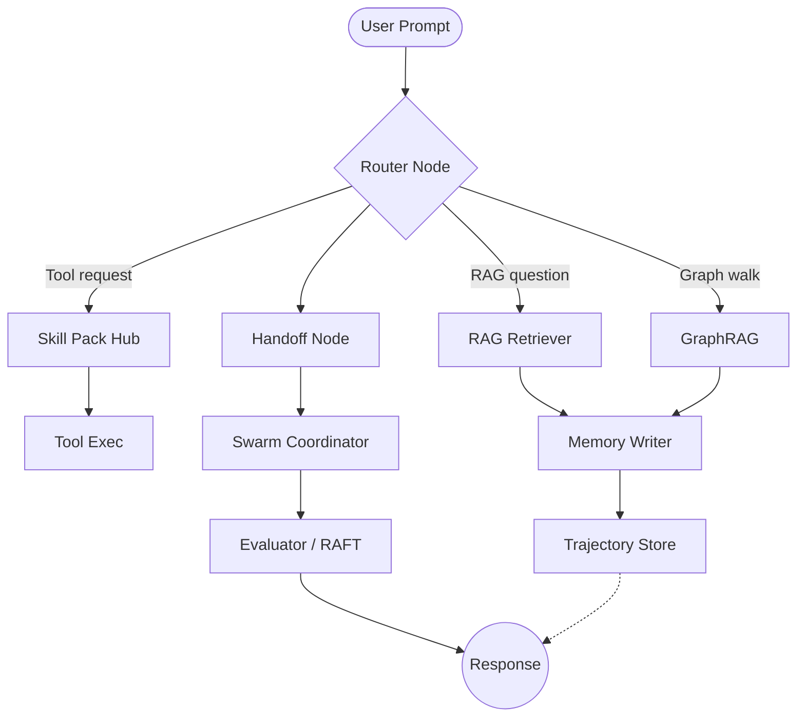

# LangGraph Agent POC
Modern LangGraph-driven multi-agent template with RAG, GraphRAG, and MCP-aware workflows.

## What this POC demonstrates
| Capability | Where it lives | Status |
| --- | --- | --- |
| LangGraph orchestration | `src/graph/graph_builder.py`, `src/graph/nodes/` | **Implemented** |
| RAG retrieval chain | `src/graph/nodes/rag.py`, `data/vectorstore/` | **Implemented** |
| GraphRAG summarization | `src/graph/nodes/graph_rag.py` + `data/graph/` | **Implemented** (lightweight entity graph + fallback) |
| Hybrid RAG+Graph fusion | `src/graph/nodes/hybrid.py` | **Implemented** |
| RAFT (Retrieval-Aware Feedback Tuning) | `docs/raft.md` + `src/graph/nodes/evaluator.py` | **Partial** (heuristic evaluator + metrics) |
| InstructLab workflow | `scripts/instructlab/` | **Planned** (scaffolding only) |
| Tool routing | `src/graph/nodes/router.py` | **Implemented** |
| Skill packs | `skills/` packages, `skills/registry.yaml` | **Implemented** |
| Agent memory (short/long) | `src/memory/checkpointer.py`, `data/memory/vectorstore/` | **Implemented** |
| Trajectory saving | `data/trajectories/`, LangGraph run logs | **Implemented** |
| Agent handoff logic | `src/graph/nodes/handoff.py` | **Partial** (single-handoff) |
| Swarm coordination | `src/graph/nodes/swarm.py` | **Partial** (planner → workers) |
| MCP tools integration | `configs/mcp_tools.yaml`, `src/integrations/mcp_client.py` | **Implemented** (filesystem + proxy) |

## Architecture


**Request flow**
1. Router inspects intent + system signals (latency/cost budgets, forced routes) and selects RAG, GraphRAG, hybrid fan-out, skill pack, or direct handoff. The routed decision plus scoring rubric are stored in `metadata.router_decision` for downstream analysis.
2. Selected node fetches documents via Qdrant vector store (Chroma fallback) or graph projection, executes HEAT-style retrieval filters, and emits tool/memory events. GraphRAG failures automatically trigger a retry then RAG fallback; hybrid runs both RAG + GraphRAG and merges the responses.
3. Short-term memory (SQLite checkpointer) captures conversation, while long-term Qdrant memory ingests timestamped artifacts and exposes time-aware retrieval.
4. Trajectory logger stores LangGraph run metadata plus tool results for replay.
5. Handoff node decides whether to delegate to another agent (e.g., `researcher` → `writer`) or escalate to swarm coordinator.
6. Swarm coordinator spins up planner/worker nodes and reconciles their votes; the evaluator node scores grounding/completeness and emits feedback/metrics before persisting to memory.

## Repo structure
```
langgraph-poc/
├── src/
│   ├── graph/
│   │   ├── graph_builder.py          # ties together LangGraph nodes
│   │   └── nodes/
│   │       ├── router.py             # intent routing + tool arbitration
│   │       ├── rag.py                # dense retrieval pipeline
│   │       ├── graph_rag.py          # graph expansion + summarization
│   │       ├── memory.py             # memory read/write helpers
│   │       ├── handoff.py            # agent delegation logic
│   │       └── swarm.py              # planner/worker orchestration
│   ├── memory/
│   │   └── checkpointer.py
│   ├── integrations/
│   │   └── mcp_client.py
│   └── runner.py
├── skills/
│   ├── research_pack/
│   │   └── tools.py
│   ├── report_pack/
│   │   └── tools.py
│   └── registry.yaml
├── data/
│   ├── knowledge_base/               # markdown/pdf corpus for RAG
│   ├── graph/                        # NetworkX graph snapshots
│   ├── memory/vectorstore/           # legacy embeddings / summaries
│   ├── qdrant/                       # Docker volume for Qdrant snapshots
│   └── trajectories/                 # LangGraph run logs
├── configs/
│   ├── graph_config.yaml
│   ├── models.yaml
│   └── mcp_tools.yaml
├── scripts/
│   ├── ingest.py
│   └── instructlab/
│       └── prepare_sft.py
├── .env.example
├── pyproject.toml
├── requirements.txt
└── README.md
```

## Quickstart
**Prereqs**
- Python 3.11+
- `uv` or `pip` for dependency management
- Optional: Docker (for local MCP servers or vector DB)

**Install**
```bash
python -m venv .venv
source .venv/bin/activate
pip install -r requirements.txt
cp .env.example .env   # fill in API keys + MCP endpoints
python scripts/ingest.py --docs data/knowledge_base
```

**Start Qdrant (local Docker)**
```bash
docker run -d --name qdrant \
  -p 6333:6333 \
  -v $(pwd)/data/qdrant:/qdrant/storage \
  qdrant/qdrant:latest
```
Stop with `docker stop qdrant` when done.

**Key environment variables (`.env.example`)**
- `OPENROUTER_API_KEY` + `OPENROUTER_MODEL` + `OPENROUTER_BASE` (default provider)
- `OPENAI_API_KEY` / `AZURE_OPENAI_API_KEY` (optional fallbacks), `ANTHROPIC_API_KEY`
- `LANGCHAIN_TRACING_V2=true` to enable LangSmith dashboards
- `MODEL_PROVIDER` (`openrouter` by default) and `EMBEDDING_PROVIDER`/`EMBEDDING_MODEL`/`EMBEDDING_DIM`
- `VECTOR_DB_PATH=./data/memory/vectorstore` (fallback) and `QDRANT_COLLECTION=langgraph_memories`
- `MCP_SERVER_REGISTRY=./configs/mcp_tools.yaml`
- `QDRANT_URL=http://localhost:6333` and `QDRANT_API_KEY=` (blank for local)
- `MEMORY_TIME_WINDOW_DAYS=30`, `MEMORY_DECAY_HALF_LIFE_HOURS=72`
- `MEMORY_TOP_K=8`, `MEMORY_TTL_TASK_DAYS=7`

**One command to run**
```bash
python -m src.runner --scenario demo/rag_qa.yaml
```
Expected: console logs showing router decision, retrieval hits, skill invocations, and a final synthesized answer stored under `data/trajectories/latest.json`.

**Stream node updates**
```bash
python -m src.runner --scenario demo/rag_qa.yaml --stream
```
This consumes `StateGraph.stream` events, prints them live, and appends structured telemetry under `data/metrics/stream.log`.

**Autonomous agent scenario**
```bash
python -m src.runner --scenario demo/autonomous_analyst.yaml
```
Routes through the LangChain-powered agent node to demonstrate cyclic planning/execution loops.

**Scenario smoke tests**
```bash
python scripts/run_scenarios.py --scenarios demo
```
See `docs/scenarios.md` for the DSL format. The CI workflow (`.github/workflows/ci.yml`) runs these tests automatically.

**Scenario validation & I/O auditing**
- Scenario YAML/HTTP payloads are validated against `ScenarioInput` (`src/schemas/scenario.py`) before the graph runs. Required fields such as `prompt` and `context` defaults prevent malformed jobs from executing.
- After each run, the final graph state is validated against `ScenarioOutput` to guarantee `output`/`metadata`/`route` are present. Validation failures are logged for follow-up.
- Every execution (CLI, batch, or UI) appends an `IOAuditRecord` to `data/metrics/io_audit.jsonl` via `IOAuditLogger`. Each record captures the scenario id, validation status, selected route, and schema errors (if any).
- Inspect audits with `tail -f data/metrics/io_audit.jsonl` to monitor schema drift or governance regressions during development and CI.
- Pick the right delivery mechanism (prompt vs. RAG vs. fine-tuning) using the catalog in `docs/strategies.md`.

**Synthetic data & robustness (Phase 7A)**
```bash
python scripts/data/build_corpus.py data/knowledge_base
python scripts/data/augment.py data/datasets/dataset_*/chunks.jsonl --variants 3 --noise 0.2
python scripts/eval/run_suite.py --trajectory data/trajectories/run_*.json --show-robustness
```
`src/data_pipeline/augment.py` generates counterfactual samples with synonym swaps, sentence shuffles, and controllable noise; robustness scores are logged inside `data/metrics/eval_suite.jsonl`.

**Adversarial + regression sweeps (Phase 7C–7D)**
```bash
python scripts/eval/adversarial_scan.py data/trajectories --report data/metrics/adversarial_report.json
python scripts/eval/regression.py snapshot data/trajectories --tag nightly
python scripts/eval/regression.py compare data/trajectories/snapshots/nightly data/trajectories
```
`src/eval/adversarial.py` uses `scripts/eval/adversarial_catalog.py` signatures to flag jailbreak/PII outputs and feeds results into `data/metrics/governance.jsonl`.

**Observation-driven tuning (Phase 7H)**
```bash
python scripts/data/audit_report.py data/metrics/io_audit.jsonl --output data/metrics/audit_summary.json
```
Summaries highlight the most common schema violations and routes so prompt/model adjustments can be prioritized.

**Run tests**
```bash
pytest
```

## Observability & Budgets
- `CostLatencyTracker` (`src/observability/costs.py`) instruments every LangGraph node, saving per-node latency/token deltas and run-level totals to `data/metrics/cost_latency.jsonl`. Router heuristics now account for `context.latency_budget_s`, `context.cost_budget_usd`, and live telemetry (spent cost / elapsed latency) to avoid overrunning budgets.
- `scripts/data/augment.py`, `scripts/eval/run_suite.py --show-robustness`, and `scripts/eval/adversarial_scan.py` provide reproducible knobs for robustness/adversarial evaluation.
- `scripts/eval/regression.py` snapshots representative trajectories and fails the build when similarity drops below configurable thresholds.
- `scripts/data/audit_report.py` condenses IO audit logs into actionable stats for tuning sessions.
- `src/eval/kpi.py` + `scripts/eval/run_suite.py` log derived KPIs (success rate, CSAT, escalation rate) into `data/metrics/kpi_report.jsonl`, comparing against targets defined in `configs/kpi_targets.yaml`.

## Deployment & Multi-tenancy
- `configs/tenants.yaml` defines per-tenant rate limits, default model providers, and feature flags. Supply `X-Tenant-ID` when hitting the FastAPI server.
- `src/ui/server.py` now exposes `/healthz`, enforces rate limits via `RateLimiter`, and ties feature availability (e.g., `/run` vs `/ws`) to `FeatureFlags`. Requests automatically tag context with `tenant_id`/`model_provider` so downstream routing honors tenant-specific constraints.
- Annotation UI (`/annotations`) now includes reviewer queues (`/queue`, `/queue/next`, `/queue/complete`), dashboards (`/dashboard`), and an active-learning endpoint (`/active-learning`) that surfaces uncertain samples from `PreferenceStore`.

## Configuration
- **Model providers**: defined in `configs/models.yaml`. Default is `openrouter` (`OPENROUTER_MODEL`, `OPENROUTER_BASE`), but you can switch via `MODEL_PROVIDER=openai|anthropic|ollama` and associated env vars.
- **Model policy**: set `MODEL_POLICY=balanced|cost_sensitive|latency_sensitive|accuracy_first` (or pass `context.model_policy` per scenario) to bias the router toward RAG, skills/prompting, or hybrid strategies using presets defined in `configs/models.yaml`.
- **Embedding provider**: `EMBEDDING_PROVIDER` toggles between OpenRouter’s OpenAI-compatible embeddings and native OpenAI. Control model + dimension via `EMBEDDING_MODEL` / `EMBEDDING_DIM` (defaults to OpenAI text-embedding-3-large at 3072 dims).
- **Vector DB**: default Qdrant (Docker). Configure via `QDRANT_URL`, `QDRANT_API_KEY`, and `VECTOR_DB_COLLECTION`. To fall back to embedded Chroma, set `VECTOR_DB_IMPL=chroma`. `scripts/ingest.py` rebuilds embeddings regardless of backend.
- **Memory backend**: short-term uses LangGraph SQLite checkpointer at `data/memory/checkpointer.sqlite`. Long-term uses Qdrant with timestamped metadata + decay-aware reranking. Tune behavior via `MEMORY_TIME_WINDOW_DAYS`, `MEMORY_DECAY_HALF_LIFE_HOURS`, `MEMORY_TOP_K`, `MEMORY_TTL_TASK_DAYS`.
- **MCP config**: `configs/mcp_tools.yaml` lists MCP servers (filesystem, Jira, custom HTTP). Enable/disable by commenting entries or overriding `MCP_ENABLED=false`. `src/integrations/mcp_client.py` handles registration per run.
- **Router tuning**: set `defaults.router.thresholds` inside `configs/graph_config.yaml` to raise/lower how aggressively the router picks GraphRAG, skills, handoff, or swarm. You can also provide `force_route`, `disable_routes`, `latency_budget_s`, and `task_complexity` per scenario to influence routing decisions.
- **Checkpoint metadata**: every LangGraph checkpoint stores tags for the scenario/user plus a `state_diff` summary, making it easy to resume or inspect runs. Resumable interrupts are enabled before `handoff` and `swarm` nodes.

## How the graph is built
Nodes are defined in `src/graph/nodes/*` and composed via `graph_builder.py`.

```python
# Router pseudocode
with State() as state:
    if state.intent == "graph":
        return GraphRAGNode
    if state.requires_tool:
        return SkillHubNode
    return RAGNode
```

**Node overview**
- **Router**: scoring heuristics + LLM classifier; selects path and enforces safety rails.
- **RAG**: embeds query, fetches top-k documents, reranks with ColBERT-lite, streams answer.
- **GraphRAG**: expands entity graph via NetworkX projection + summarizer; partial weighting stub remains.
- **Memory**: `memory_write_node` stamps episodic events (ts/type/source/tags) into Qdrant; `memory_retrieve_node` blends semantic scores with recency decay.
- **Skills**: loads registry-defined tools and executes via tool router.
- **Handoff**: detects persona mismatch, clones state, hands off to next agent.
- **Swarm**: planner agent decomposes task, workers execute skill packs, aggregator reconciles.
- **Evaluator**: (planned RAFT) scores final output vs retrieved context.

## Tools & Skills
- **Built-in tools**: vector-backed knowledge search, filesystem MCP bridge, structured calculator, `search_memory` / `write_memory`. Skill executions now flow through a `ToolNode` abstraction that records metadata (`metadata.tools`) and emits uniform tool messages.
- **Skill packs**:
  - `research_pack` now routes through the same vector store as the RAG node to surface grounded snippets plus autogenerated note summaries.
  - `report_pack` emits multi-section outlines and markdown-ready reports for downstream presentation.
  - `ops_pack` persists ticket requests under `data/ops/tickets.jsonl`, simulating a Jira/GitHub destination without exposing secrets.
  - MCP-registered servers (e.g., the filesystem tool defined in `configs/mcp_tools.yaml`) show up as a synthetic `mcp` pack so the router can delegate to them like any other skill.

**Add a new skill pack**
1. Create `skills/<name>_pack/tools.py` exporting LangChain tool functions.
2. Register the pack in `skills/registry.yaml` with capabilities + authorization rules.
3. Optional: add custom MCP server entry if skill depends on remote resource.
4. Restart the runner; router auto-discovers the pack via registry.

## Memory
- **Short-term**: per-conversation state persisted with LangGraph checkpointer. Stores user turn history, scratchpad, latest tool outputs. Retention: 24h rolling (configurable).
- **Short-term summarizer**: `ConversationSummaryNode` compresses the chat buffer when it exceeds the configured threshold and records summaries in `metadata.summaries` so checkpoints stay lightweight.
- **Async memory writes**: `MemoryWriteNode` now queues persistence work on a background executor so long-term storage never blocks the main LangGraph run.
- **Long-term (temporal)**: approved artifacts embedded into Qdrant with metadata (`ts`, `importance`, `category`, `source`). Retrieval blends cosine similarity with recency decay: `final_score = similarity + α * exp(-(now - ts)/τ) + β * importance`, where τ derives from `MEMORY_DECAY_HALF_LIFE_HOURS`.
- **Time windows & TTL**: queries can restrict to `MEMORY_TIME_WINDOW_DAYS`, and categories respect TTL (`task_state` default 7 days via `MEMORY_TTL_TASK_DAYS`, `user_preferences` never expires). Stale entries are pruned nightly.
- **Hierarchical summaries**: after every 20 turns (or when state > token threshold) a summary tool writes `daily_summary_YYYY-MM-DD` events; weekly aggregation is planned next.
- **Privacy**: `.env` flag `ALLOW_MEMORY_WRITE=false` disables persistence; trajectories omit sensitive tool payloads when `SCRUB_TRAJECTORIES=true`.

Run `python scripts/memory/prune.py` periodically to drop expired `task_state` entries when using the filesystem fallback store.

## Trajectory / Observability
- Every LangGraph run emits JSONL traces under `data/trajectories/<timestamp>.jsonl`.
- LangSmith tracing (optional) captures spans, model inputs, tool logs.
- Replay by running `python scripts/replay_trajectory.py --path data/trajectories/<file>`.
- Grafana/Loki integration (Planned) for latency dashboards.

## Agent handoff & swarm
- **Handoff trigger**: router or evaluator flags unmet persona or capability needs (e.g., `researcher` finished but writing required). Handoff node clones the working memory minus sensitive slots and invokes target agent config.
- **Swarm coordination**: planner agent decomposes task into subgoals, assigns to worker agents tied to skill packs, and merges outputs via weighted voting. Currently partial, supporting up to 3 workers round-robin; backlog includes dynamic scaling and consensus scoring.

## RAG / GraphRAG / RAFT / InstructLab details
- **RAG (Implemented)**  
  - *Definition*: dense retrieval over docs in `data/knowledge_base`.  
  - *Pipeline*: embed query → vector search (k=6) → rerank (cross-encoder) → answer synth.  
  - *Demo*: `python -m src.runner --scenario demo/rag_qa.yaml`.  
  - *Sample prompt*: “Summarize the LangGraph memory strategy in 3 bullets.”
- **GraphRAG (Partial)**  
  - *Definition*: combine graph traversal + summarization for entity-heavy questions.  
  - *Pipeline*: detect entities → query NetworkX graph → fetch linked docs → produce aggregated summary.  
  - *Demo*: `python -m src.runner --scenario demo/graphrag.yaml`.  
  - *Sample prompt*: “How do the research and report agents collaborate?”
- **RAFT (Planned)**  
  - *Definition*: Retrieval-Aware Feedback Tuning — an evaluation loop scoring responses vs retrieved context and feeding back to skill weights.  
  - *Pipeline (planned)*: evaluator checks hallucination, coverage, latency → adjust router + swarm heuristics.  
  - *Demo*: `python scripts/raft/run_eval.py --scenario demo/rag_qa.yaml` (placeholder).
- **InstructLab (Planned)**  
  - *Definition*: Instruction-tuning workflow using IBM’s InstructLab recipes to fine-tune local models on captured trajectories.  
  - *Workflow (planned)*: export trajectories → generate synthetic pairs via InstructLab → fine-tune `mistral` locally.  
  - *Run*: `scripts/instructlab/prepare_sft.py` (scaffolding) followed by InstructLab CLI commands.

## Demo scenarios
1. **Competitive research brief**: User asks “Compare Neo4j vs ArangoDB for GraphRAG.” Expect router → RAG + GraphRAG combination, skill pack writes structured brief.
2. **Bug triage via MCP**: Prompt “File a Jira ticket if CPU > 90%.” Router sends to ops skill pack, MCP Jira tool planned to execute; currently logs planned action.
3. **Multi-agent writing**: Prompt “Draft a blog outline about multi-agent LangGraph systems.” Research agent gathers data, handoff to writer agent, swarm consolidates sub-sections.

## Evaluation
- **Definition of done**: answers grounded in retrieved docs, handoffs succeed without dropping context, tool errors <5%.
- **Evaluator node**: `src/graph/nodes/evaluator.py` inspects the latest output + artifacts, produces heuristic grounding/completeness scores, and writes them to `metadata.evaluations` plus `data/metrics/raft_runs.jsonl`.
- **Metrics**: latency (p95 < 12s), faithfulness (heuristic evaluator), retrieval hit rate (>0.7 relevant docs), tool success rate (>0.9), swarm agreement score (planned RAFT).
- **Router feedback**: when a score drops below the configurable threshold, the evaluator sets `metadata.router_feedback` (e.g., “increase_graph_weight”) so future runs can adjust heuristics.

## Telemetry & Streaming
- Enable `LANGCHAIN_TRACING_V2=true` with LangSmith credentials to capture LangGraph spans; router decisions, tool metadata, and evaluator outputs all include descriptive tags.
- Use `python -m src.runner --scenario ... --stream` to consume `graph.stream` events in real time. Each event is mirrored via `TelemetryLogger` into `data/metrics/stream.log` for post-run analysis.
- Evaluation summaries accumulate in `data/metrics/raft_runs.jsonl`. Inspect this file to monitor grounding/completeness trends per scenario.
- Maintenance tip: run `python scripts/memory/prune.py` to remove expired `task_state` entries from the filesystem-backed memory store.
- Cross-functional guidance lives in `docs/playbooks/` (data engineering and product alignment) to help with handoffs and release checklists. CI (`.github/workflows/ci.yml`) now runs dataset builds, RLHF dry runs, and responsible-AI evaluations before merges.

## Web Playground
- Launch the FastAPI server:
  ```bash
  uvicorn src.ui.server:app --reload
  ```
  POST `/run` with `{ "prompt": "...", "context": {...} }` for synchronous runs, or open a WebSocket at `/ws` to receive streaming LangGraph events.
- The default Docker container runs this server on port 8000; see `Dockerfile`.

## Containerization & Environments
- Build & run:
  ```bash
  docker build -t langgraph-poc .
  docker run -p 8000:8000 --env-file .env langgraph-poc
  ```
- Configure graph behavior per environment by pointing `GRAPH_CONFIG_PATH` at `configs/graph_config.dev.yaml`, `configs/graph_config.stage.yaml`, or `configs/graph_config.prod.yaml`. The runner, UI, and scenario CLI honor this variable, so CI can target dev while production uses hardened thresholds.

## Roadmap
- Implement RAFT evaluator loop + weight updates.
- Finish MCP integrations for Jira & GitHub issues.
- Expand swarm coordination to elastic worker pools.
- Complete InstructLab training script with automated dataset export.
- Add UI harness (Gradio) for interactive demos.

## Troubleshooting
- **Vector store missing**: run `scripts/ingest.py` after populating `data/knowledge_base`.
- **MCP connection errors**: verify server URLs in `configs/mcp_tools.yaml` and ensure `MCP_ENABLED=true`.
- **Memory not persisting**: check write permissions to `data/memory/` and `ALLOW_MEMORY_WRITE`.
- **LangGraph state errors**: delete `data/memory/checkpointer.sqlite` (will rebuild) if schema changes.

## Security & data notes
- Secrets stay in `.env`; do not commit.  
- Set `SCRUB_TRAJECTORIES=true` to redact tool payloads before saving.  
- MCP servers can expose filesystem; keep `configs/mcp_tools.yaml` minimal for production.  
- Vector store contains derived insights—prune before sharing repo.

## License / Contributing
- **License**: MIT (update `LICENSE` if company policy differs).  
- **Contributing**: open a PR with linted code (`ruff`, `mypy`), include scenario recording, and document new skills in `skills/registry.yaml`.
## Model Benchmarking
- Define tasks in `configs/benchmark_tasks.yaml` and model metadata (cost, latency, privacy) in `configs/models.yaml`.
- Run the harness:
  ```bash
  python scripts/models/benchmark.py --tasks configs/benchmark_tasks.yaml --output data/metrics/model_benchmarks.jsonl
  ```
  A table plus JSONL is emitted so you can compare models when selecting LLM/SLM backends.

## Data Preparation Pipeline
- Build cleaned + chunked corpora and update the dataset manifest:
  ```bash
  python scripts/data/build_corpus.py data/knowledge_base --dataset-id kb_v1
  ```
  Outputs `data/datasets/kb_v1/chunks.jsonl` and records stats/lineage in `data/datasets/manifest.json`.
- Generate quality metrics:
  ```bash
  python scripts/data/quality_report.py data/datasets/kb_v1/chunks.jsonl --output data/metrics/data_quality.json
  ```

## RLHF / DPO Toolkit
- Collect pairwise preferences via the FastAPI playground: POST `/annotations/preferences` with `{prompt, response_a, response_b, winner, annotator_id}` and fetch `/annotations/bias-metrics` to monitor annotator dominance. Data lands in `data/annotations/preferences.jsonl`.
- Train reward-model stubs and orchestrate RLHF steps:
  ```bash
  python scripts/rlhf/train_reward.py --preferences data/annotations/preferences.jsonl --output data/rlhf/reward_model.json
  python scripts/rlhf/run_pipeline.py --preferences data/annotations/preferences.jsonl --output-dir data/rlhf
  ```
  These scripts log reward weights, update policy placeholders, and emit bias metrics under `data/rlhf/`.

## Evaluation & Governance
- Run the comprehensive evaluation suite plus governance checks on any trajectory:
  ```bash
  python scripts/eval/run_suite.py demo/sample_trajectory.json --requirements "Must cite sources" --judge-model gpt-4o-mini
  ```
  Results populate `data/metrics/eval_suite.jsonl`, `data/metrics/governance.jsonl`, and `data/metrics/judge.jsonl` (LLM-as-a-judge verdicts).
